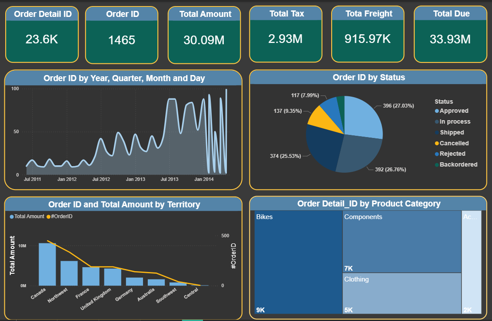

# 📊 Sales Orders Dashboard

A dynamic and interactive dashboard for tracking, managing, and analyzing sales orders — giving teams real-time visibility into order performance, revenue trends, and fulfillment status.

---

## 🚀 Features

- **Orders Overview** — Get a high-level summary of total orders, revenue, and average order value at a glance.
- **Sales Trend Analysis** — Visualize sales performance over time with interactive charts and date range filters.
- **Order Status Tracking** — Monitor orders by status (Pending, Processing, Shipped, Delivered, Cancelled) in real time.
- **Top Products & Categories** — Identify best-selling products and categories driving the most revenue.
- **Customer Insights** — View order history and purchasing patterns by customer.
- **Filterable & Searchable Table** — Browse, search, and filter all orders by date, status, region, or customer.
- **Export Reports** — Download order summaries and filtered data as CSV or PDF.
- **Responsive Design** — Fully optimized for desktop and tablet screens.

---

## 📸 Screenshots

> Add your screenshots below by replacing the placeholder links.

### Dashboard Overview

### Sales Trend Chart

---

## 🛠️ Tech Stack

> Update this section to reflect your actual stack.

- **Charts:** (e.g. Chart.js, Recharts, D3.js)

---

## 📬 Contact

Have questions or suggestions? Open an issue or reach out via GitHub.
